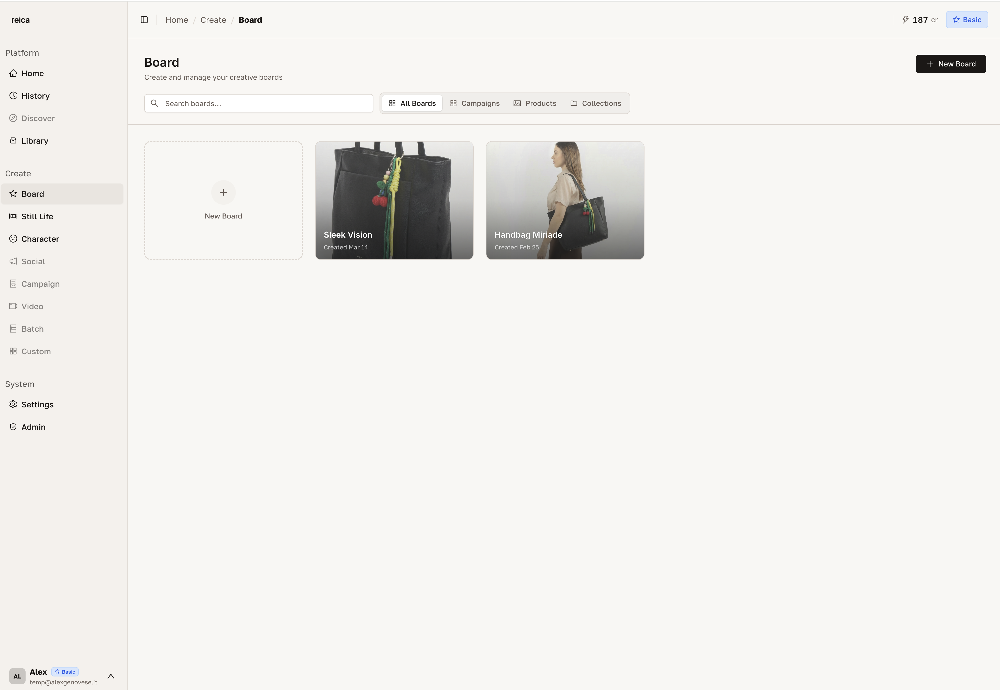
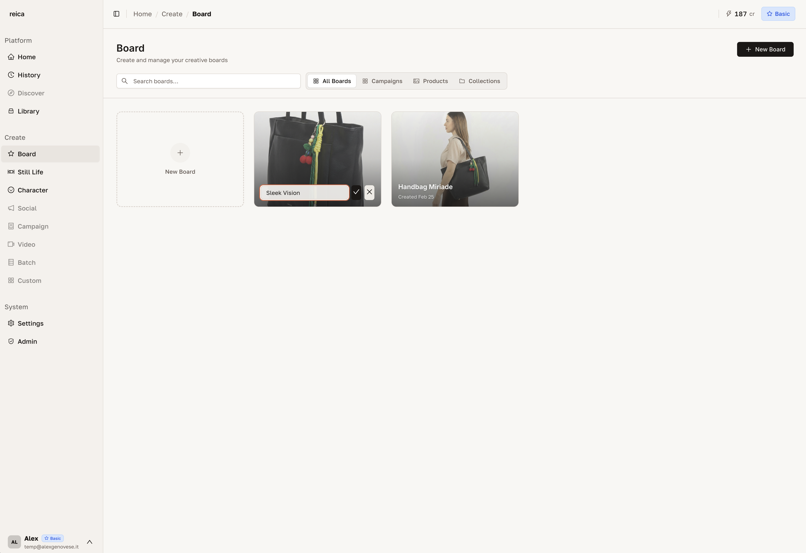
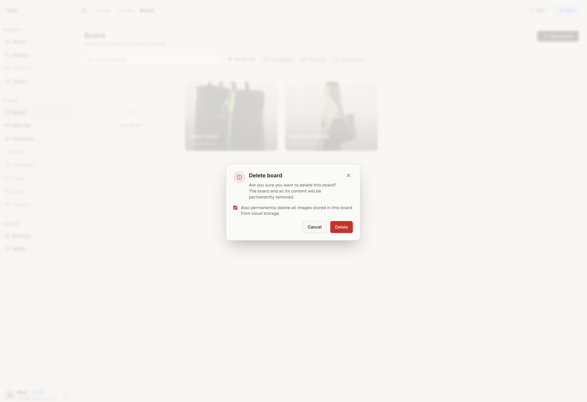
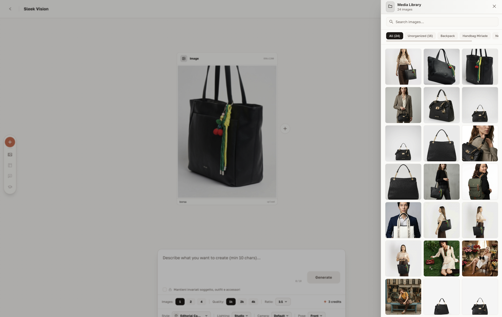
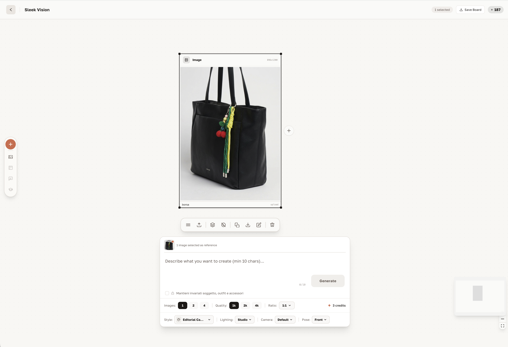
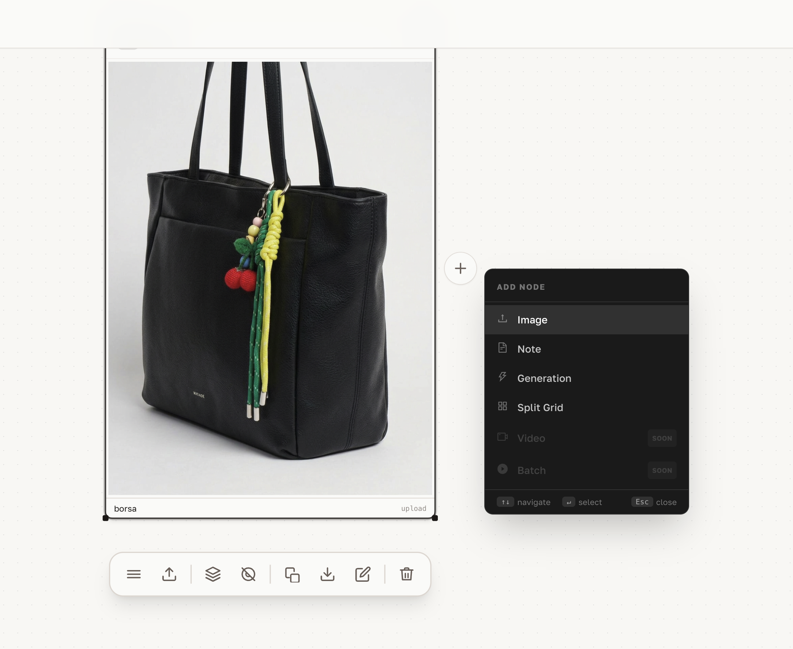
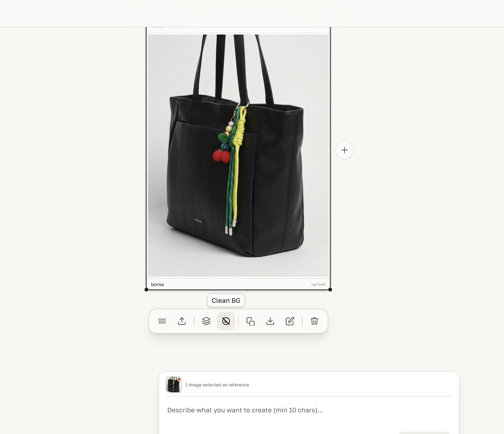
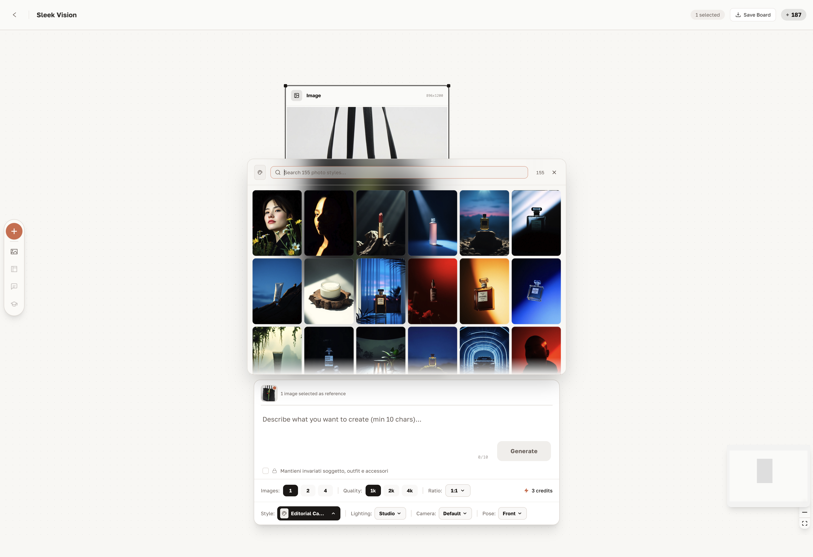

# Board

The Board is Reica's canvas. It's where reference images become campaign-quality generations — connected, consistent, and built visually instead of with text.

---

## Your Boards

When you open the Board section, you see a grid of all your active boards.

Each card shows the board name, thumbnail of recent nodes, and last updated date.

### Create a new Board
Click **New Board**. A blank canvas opens immediately.

### Rename a Board
Click the board name or use the rename option on any board card.

### Delete a Board
Use the delete option on the board card. You can also choose to delete all images inside it.

---

## Inside the Board canvas

### Starting with a reference image

The Board always starts with a node. Your first step is uploading a reference image — a garment, a model photo, a mood board frame.

Once your image is on the canvas:
- A **textarea** appears below the node for optional additional instructions
- The generation options appear in the sidebar on the right

### Opening the Library panel

Click the **second button in the left sidebar** to open the Library panel directly inside the Board. You can upload any image from your library to the canvas with a single click — without leaving the Board.

---

## Working with nodes

Each image on the Board is a **node**. Nodes can be connected, edited, and generated from.

### Selecting one or multiple images

Click a single node to select it. Hold Shift to select multiple nodes. When multiple nodes are selected, you can generate from all of them simultaneously — useful for try-ons combining garment + model references.

### Linking nodes

With a node selected, click the **+ button** that appears. A menu opens with options to link the current node to a new generation, creating a chain of connected visual references.

### Editing a node

Right-click or select a node to access the **professional edit menu**. Options include:
- Crop, scale, or reposition the image
- Adjust exposure, contrast, and colour
- Remove background
- Replace the image with a new upload

---

## Photographic styles

Add a photographic style to any generation to achieve a consistent editorial look across all nodes.

Styles include:
- **Editorial** — high fashion, dramatic contrast
- **Studio** — clean, commercial
- **Natural** — soft light, lifestyle feel
- **Cinematic** — film-quality depth and tone

---

## Board workflow: end-to-end example

Here's how a typical campaign Board session looks:

1. **Upload hero garment** as the first node
2. **Open Library panel** → add a character reference photo
3. **Select both nodes** (garment + character)
4. **Choose photographic style** → Editorial
5. **Generate** → campaign-quality try-on appears as a new node
6. **Link to new nodes** for additional angles, colours, or looks
7. **Export** all generated images at 4K

---

## Tips for better Board results

- Use **high-resolution reference images** — the AI reads detail, not just composition
- Combine **garment + character references** for the most realistic try-ons
- Apply a **consistent style** to all nodes in the same board to maintain campaign coherence
- Use **front + back garment uploads** via the Library for complex shapes

---

## Related

- [Character guide](/features/character) — create reusable characters for your boards
- [Library guide](/features/library) — manage and upload reference images
- [Use Cases](/use-cases) — see Board in real brand scenarios
