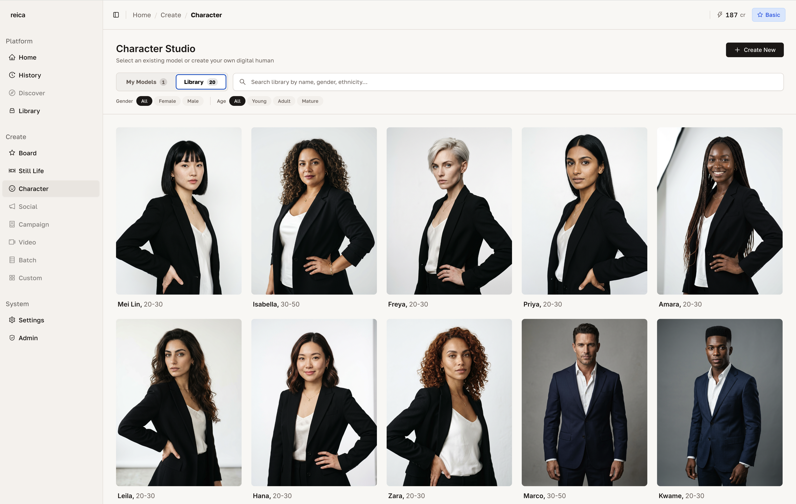
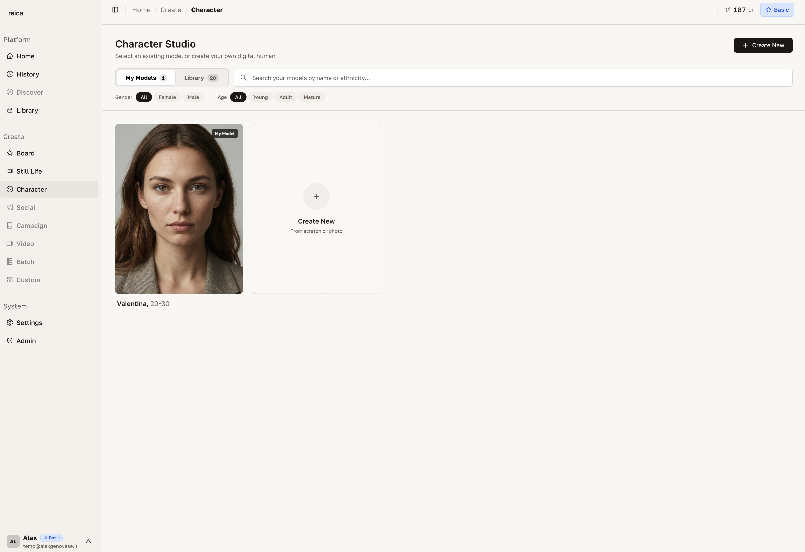
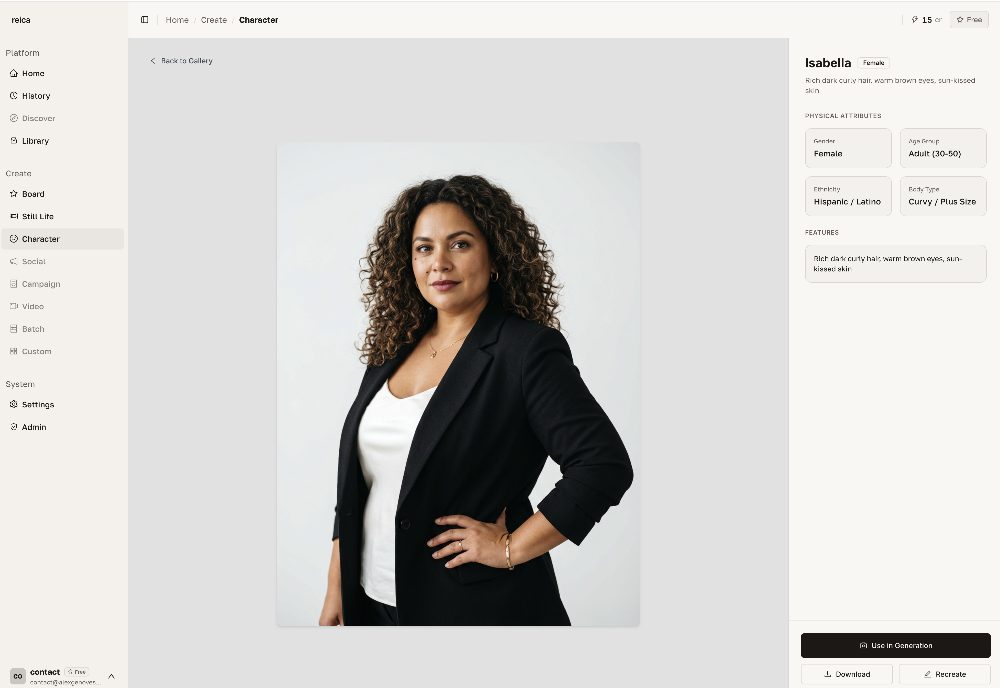
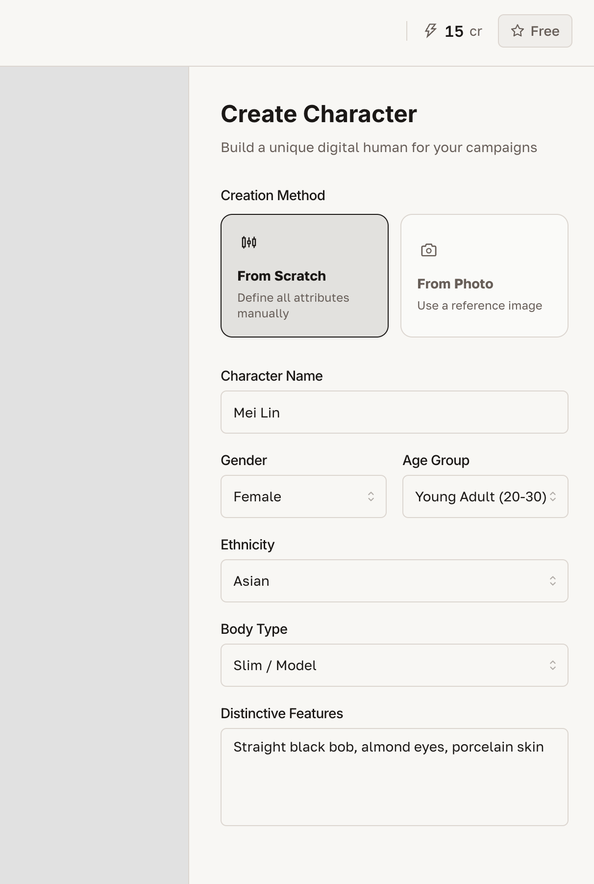

# Character

Characters are Reica's answer to consistency. Create a model once — save it to your library — and use it across every generation, every format, every campaign. The same face. The same proportions. Every time.

---

## Your character library

When you open the Character section, you see all your saved characters in a grid. You can also browse **Reica's default library** of AI characters — ready to use immediately, no creation required.

---

## Creating a new character

Click **Create New** to open the character generation form.

From here you can define:
- **Appearance** — gender, age range, skin tone, facial features, hair
- **Style reference** — upload an inspiration image (a model photo, editorial reference)
- **Name** — for easy identification in your library

Reica generates a base character that you can review and refine before saving.

---

## Character options

Click on any character in your library to see all available options.

Options include:
- **Use in Still Life** — open a product shoot with this character pre-selected
- **Use in Board** — add this character as a node in your current Board
- **Recreate** — generate a variation starting from this character
- **Edit** — adjust details and regenerate
- **Delete** — remove from your library

---

## Recreating from a character

The **Recreate** option lets you generate new characters that share the same base as an existing one — useful for creating a character family or exploring variations while maintaining a recognisable brand identity.

When you click Recreate, sliders and controls appear for:
- Adjusting age, skin tone, hair colour, facial structure
- Applying a different lighting or style reference
- Generating siblings or editorial variants of the same character

---

## Using characters in generations

A saved character can be used in:

| Generation type | How to use |
|---|---|
| **Still Life** | Click "Choose a Character" in the Still Life form |
| **Board** | Open the Library panel → Characters → add to canvas |
| **Batch** | Select character once → apply to all SKUs in the batch |

---

## Best practices for characters

- **Give characters clear names** — include notes like "Spring 2026 Campaign Character" for easy recall
- **Create 2–3 characters per brand** — a primary face, an alternative, and a lifestyle character for variety without inconsistency
- **Use Recreate for seasonal variations** — keep the brand character recognisable but with fresh variations per season
- **Combine with a consistent photographic style** in the Board for maximum campaign coherence

---

## Related

- [Board guide](/features/board) — use characters in canvas compositions
- [Still Life guide](/features/still-life) — on-model product photography
- [Use Cases](/use-cases) — see how consistent characters power real campaigns
