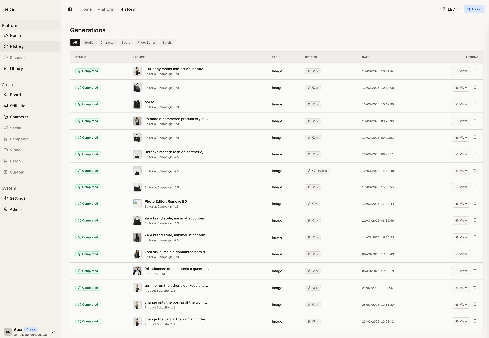
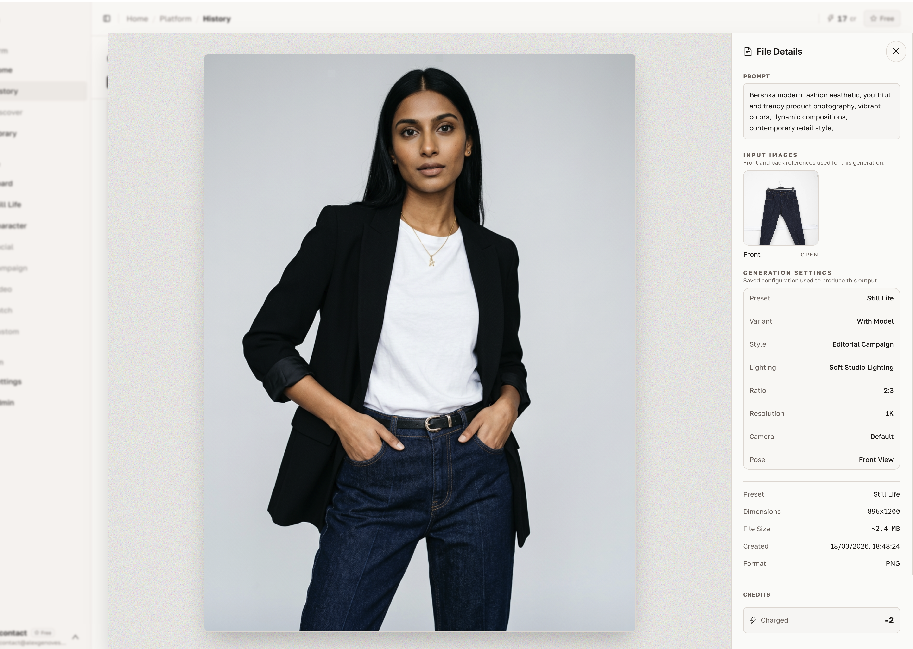
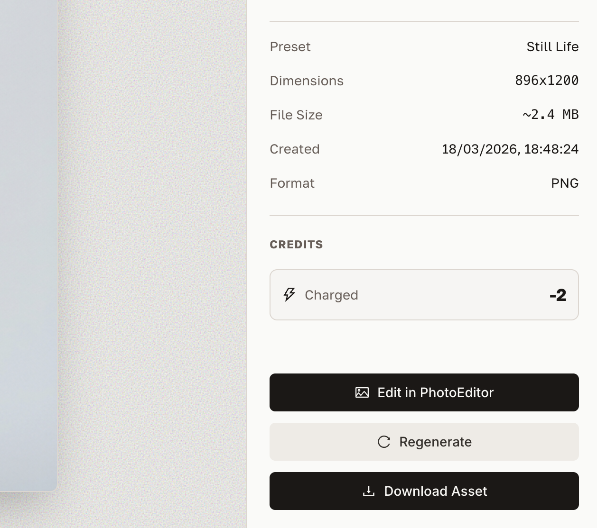

# History

History is your complete archive of every generation you've ever made in Reica. Find any past output, review its settings, and reuse it as the starting point for a new creation.

---

## Generations list

The History screen shows all your past generations in a structured list — most recent first.

Each entry shows:
- Thumbnail of the output
- Generation mode used (Still Life, Board, Batch)
- Date and time
- Quick action buttons

---

## Viewing full details

Click **View** on any generation to open the detail panel. All settings used in that generation appear on the right side of the screen.

The details panel shows:
- Output image at preview resolution
- Character used (if any)
- Photographic style applied
- Output type (Ghost, Flat Lay, On-model, etc.)
- Lighting and background settings
- Aspect ratio and resolution
- Generation timestamp

This is useful for reproducing the exact same look for a new product or season.

---

## Sidebar actions

Within the History view, the bottom of the sidebar gives you quick access to common actions.

Common actions available from the sidebar:
- **Download** the selected generation at full resolution
- **Reuse** — open the generation form with all settings pre-filled
- **Add to Library** — save the output to a folder in your Library
- **Delete** — permanently remove the generation

---

## Finding past generations

Use the filter and search options to narrow down your history:

| Filter | What it does |
|---|---|
| Generation mode | Show only Still Life, or Board, or Batch outputs |
| Date range | Filter by when the generation was created |
| Character | Show all generations using a specific character |
| Style | Show all generations with a specific photographic style |

---

## Reproducing a past look

This is one of the most common History workflows:

1. Find the past generation that had the look you want to replicate
2. Click **View** → check all the settings on the right panel
3. Click **Reuse** → the form opens with every setting pre-filled
4. Replace only the product image (or change one variable)
5. Generate — same look, new product

---

## Related

- [Library guide](/features/library) — organise your generated outputs into folders
- [Still Life guide](/features/still-life) — learn all the settings visible in History detail panels
- [Board guide](/features/board) — Board generations also appear in History
