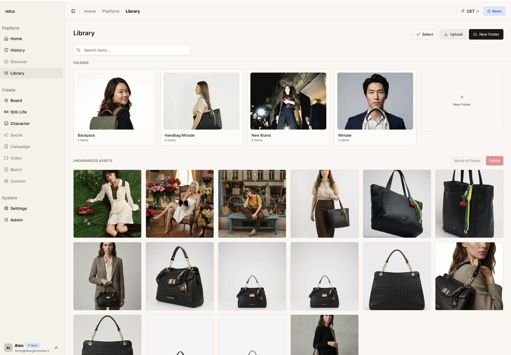
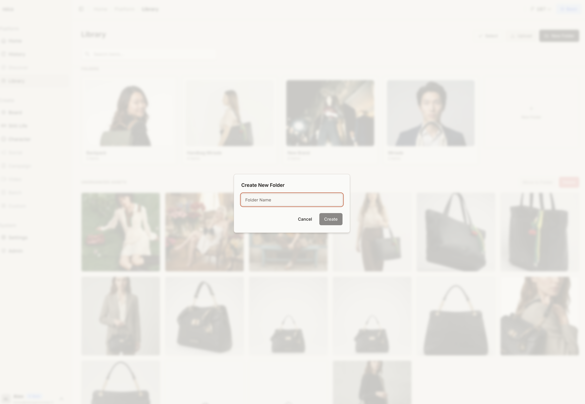
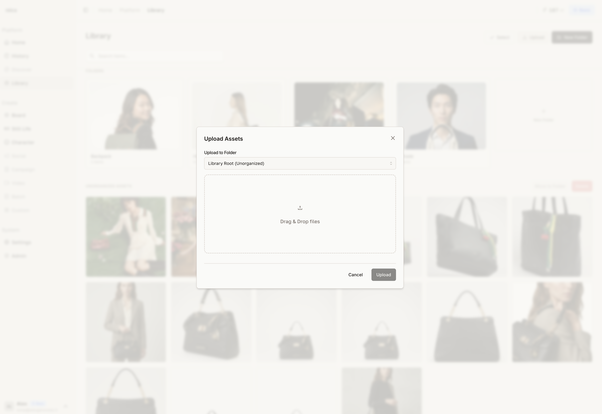
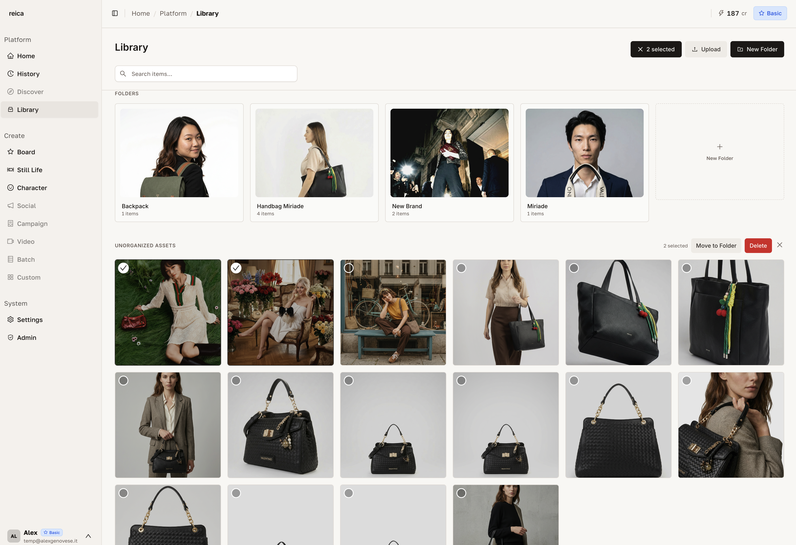

# Library

The Library is Reica's asset hub. Every product image, reference photo, and generated output lives here — organised in folders, accessible from anywhere in the platform.

---

## Library layout

The Library uses a **split-screen layout**: folders and organisation on the left, recent generations on the right.



- **Left side** — your folder tree. Create, rename, and move folders. Drag images between folders.
- **Right side** — all recent generations, automatically saved here. Scroll to find any output.

---

## Creating folders

Click **New Folder** to add a folder at any level of your organisation.



You can create as many nested folders as you need. Suggested structure for most brands:

```
Library/
├── Products/
│   ├── SS26/
│   └── AW26/
├── References/
│   ├── Models/
│   └── Moods/
└── Campaigns/
    ├── Spring Drop/
    └── Lookbook/
```

---

## Uploading images

Click **Upload** to add images to the currently selected folder — or drag and drop directly from your desktop.



Supported formats: JPEG, PNG, WebP.  
No size limit — Reica handles high-resolution files.

---

## Multi-selection

Select multiple images at once by clicking the selection mode button (or using Cmd/Ctrl + click on individual images).



With multiple images selected you can:
- **Move** to a different folder
- **Delete** all selected images at once
- **Add to Board** — drop selected images directly onto a canvas
- **Use in Batch** — send to a Batch operation

---

## Accessing the Library from other features

You don't have to leave your workflow to use the Library:

- **Inside the Board** — click the Library icon in the left sidebar to open a panel without leaving the canvas
- **Inside Still Life** — click "Choose from Library" to pick any uploaded product
- **Inside Character** — browse saved characters directly

---

## Tips for keeping your Library organised

- **Create folders before uploading** — it's faster than moving files later
- **Name folders by season or campaign** — you'll thank yourself in 6 months
- **Use the multi-select** to batch-move new uploads to the right folder immediately
- **The right panel (recent generations)** is your safety net — everything you generate is always findable here

---

## Related

- [History guide](/features/history) — filter and review all past generations with full details
- [Board guide](/features/board) — use Library assets directly in canvas compositions
- [Still Life guide](/features/still-life) — upload products for product photography
