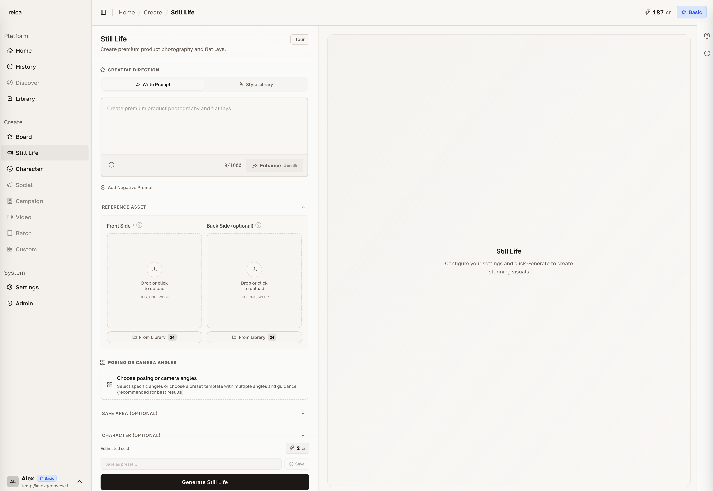
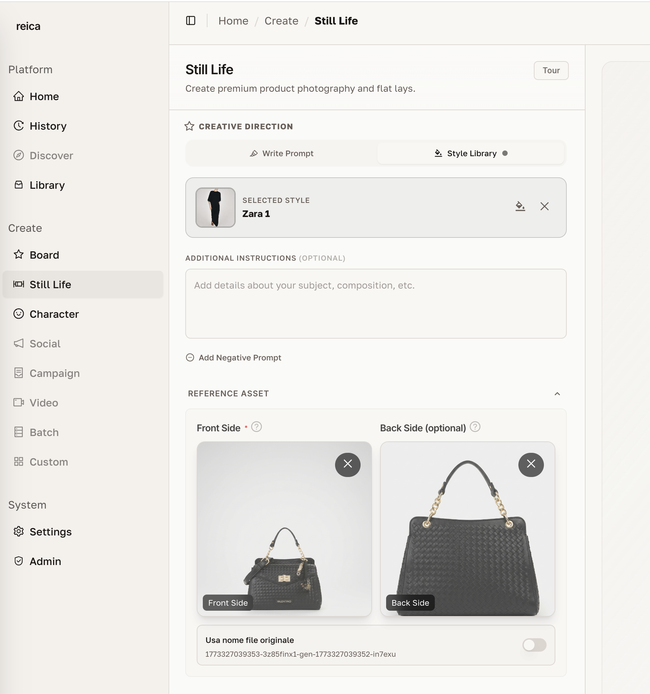
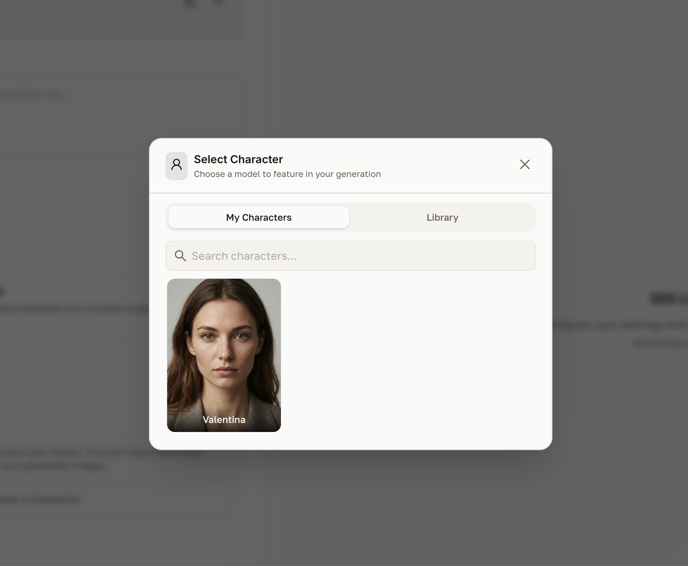
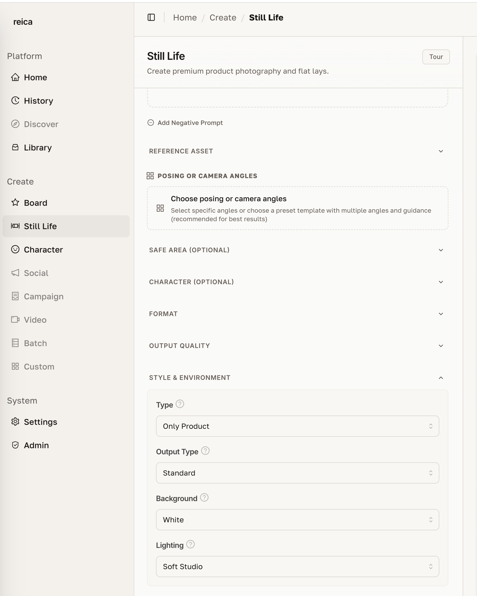
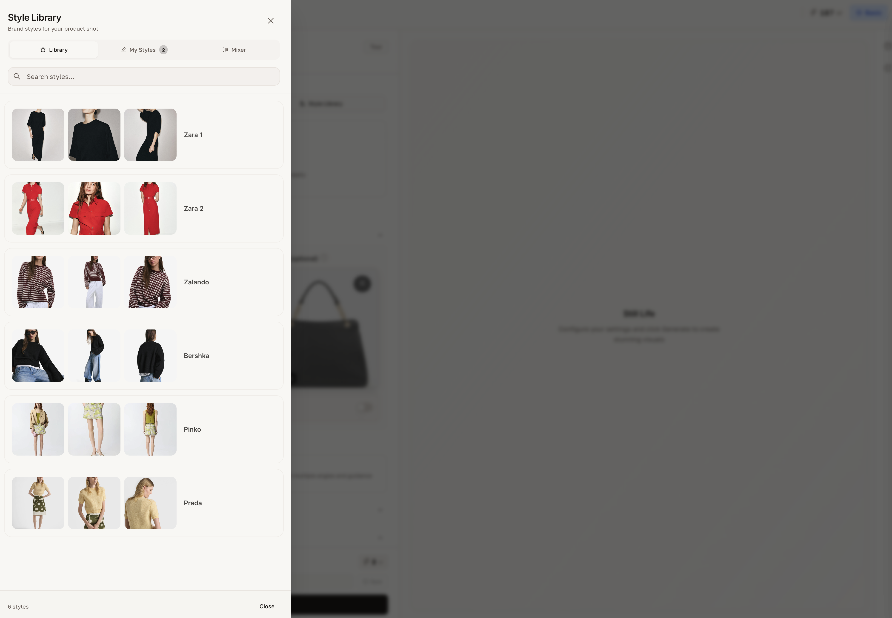
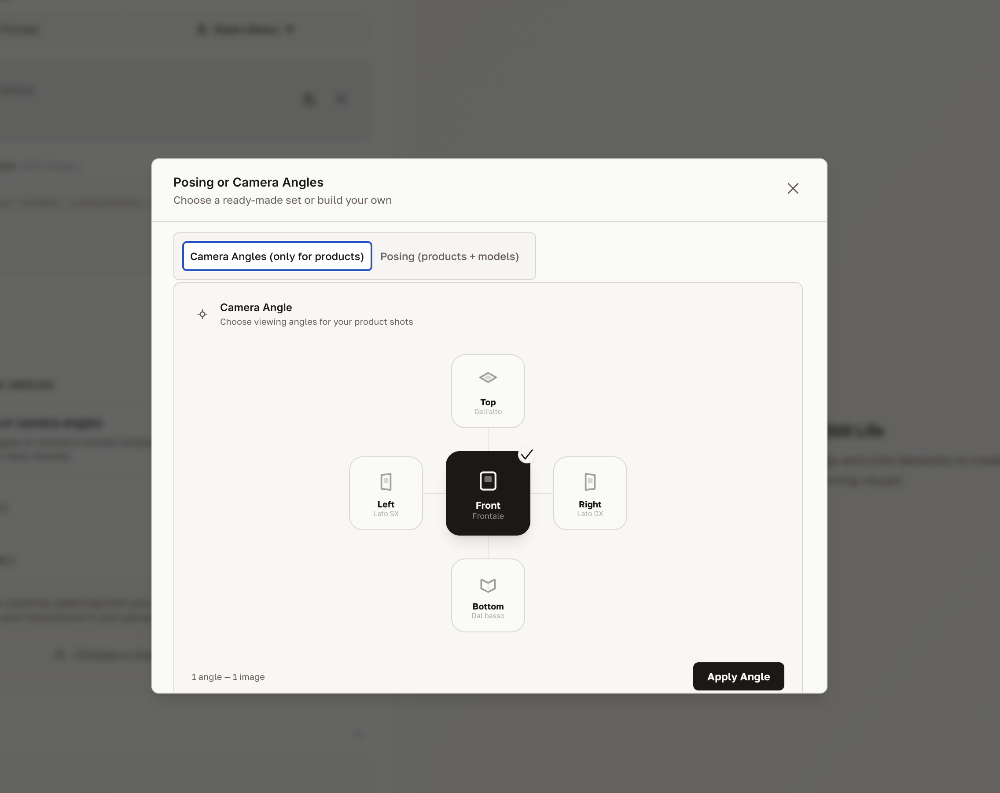
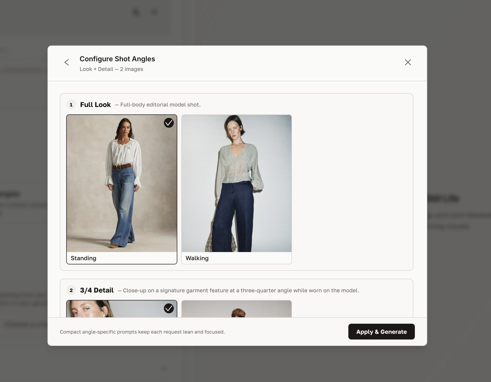
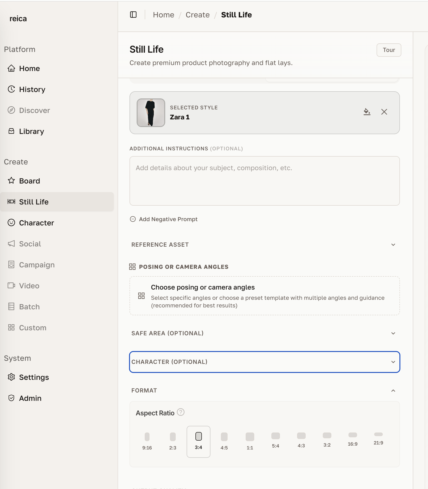
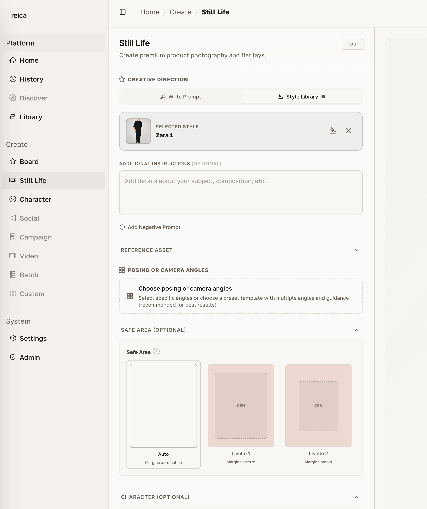
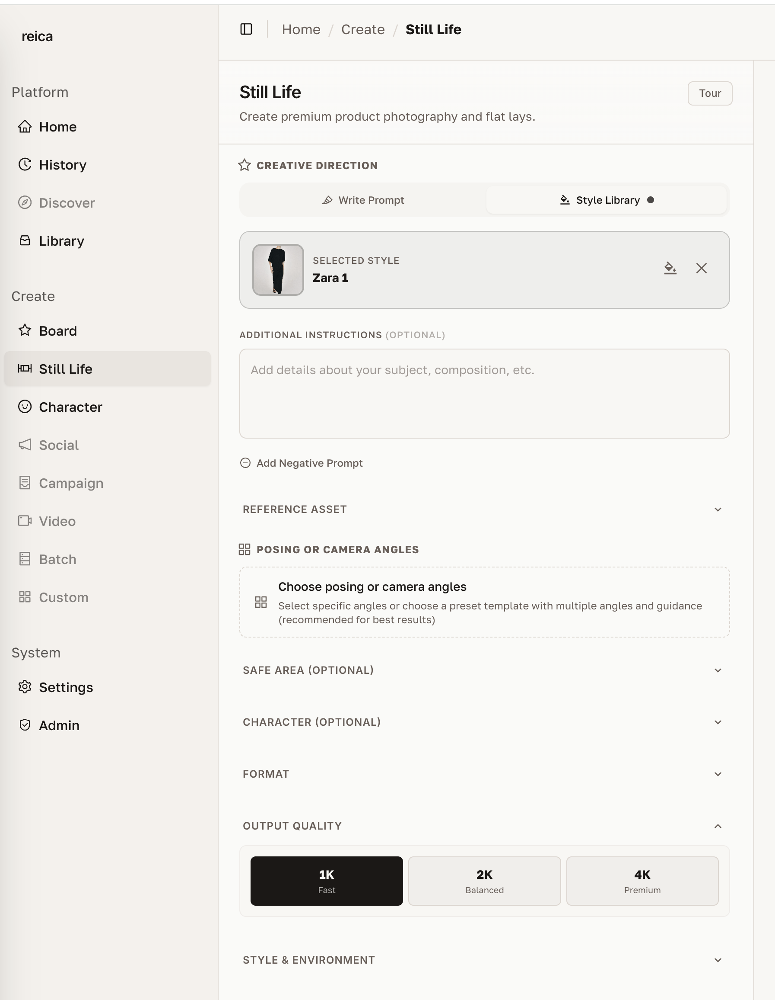

# Still Life

Still Life is Reica's product photography engine. Upload a product image and get professional-quality output — ghost mannequin, flat lay, on-model, or contextual still life — in seconds.

---

## Opening Still Life

From the Home dashboard, click **Still Life** in the shortcuts. The generation form opens immediately.

---

## Step 1 — Upload your product

Drag and drop your product image onto the upload area, or click to browse.

**For the best results:**
- Use a clean, well-lit product image
- Avoid busy backgrounds (the AI removes them automatically but a plain background helps)
- For apparel and garments: upload **front and back** in the same session

### Why upload front and back?

Uploading both sides of a garment gives the AI significantly more information about the product's shape, seams, collar, and construction — resulting in more accurate and realistic output.

---

## Step 2 — Choose an Output Type

Select what you want the AI to produce:

| Output Type | Best for |
|---|---|
| **Ghost mannequin** | E-commerce PDPs, technical catalogue |
| **Flat lay** | Social media, editorial, overhead shots |
| **On-model** | Lifestyle imagery, lookbooks, campaigns |
| **Still life** | Accessories, beauty products, contextual scenes |

---

## Step 3 — Choose a Character (on-model outputs)

If you selected an on-model output type, click **Choose a Character** to assign a character to the shoot.

You can:
- Select from **your saved characters** (created in the Character module)
- Browse **Reica's default library** — ready-to-use AI models in diverse styles
- Continue without a character for product-only outputs

---

## Step 4 — Set up lighting and background

Configure the atmosphere of the shot:

- **Lighting** — studio, natural, golden hour, dramatic, soft box
- **Background color** — choose from presets or enter a custom hex value
- **Surface** — marble, wood, fabric, concrete, transparent

---

## Step 5 — Apply a photographic style

Click **Style** to apply a preset photographic style to the entire generation.

Styles are calibrated specifically for fashion and beauty. Each one adjusts colour grading, contrast, and tone to match a specific editorial aesthetic — from clean commercial to rich editorial.

---

## Step 6 — Set posing and camera angles (on-model)

For on-model outputs, you can direct:

### Camera angles

Options include frontal, three-quarter, side profile, back view, and editorial angles.

### Body poses

Choose from a library of poses: standing, walking, seated, dynamic, editorial, and more. Poses are calibrated for fashion and designed to make garments read clearly.

---

## Step 7 — Set aspect ratio

Choose the output dimensions that match your target channel.

Common presets:
- **1:1** — Instagram square, product grid
- **4:5** — Instagram portrait, e-commerce PDP
- **9:16** — Stories, TikTok, mobile hero
- **3:4** — Lookbook, editorial print
- **Custom** — enter exact pixel dimensions

---

## Safe Area (product positioning)

The Safe Area setting is useful when working with products that need a specific position within the canvas — for example, a handbag centred at the bottom of an editorial image.

Drag the safe area bounds to define where the product must appear. The AI will compose the scene around that constraint.

---

## Output resolution

Reica generates at up to **4K resolution** — ready for print, out-of-home, and high-resolution digital.

Select your target resolution before generating. Higher resolutions take slightly longer but produce sharper results.

---

## Tips for best Still Life results

- **Front + back upload** is the single highest-ROI change for apparel accuracy
- **Match the aspect ratio to your channel** before generating — cropping after loses quality
- **Choose a style first** then lighting — they work together
- **Use Safe Area** for products with strict brand positioning requirements
- **Start with studio lighting** if unsure — it's the most versatile for e-commerce

---

## Related

- [Character guide](/features/character) — create and manage on-model characters
- [History guide](/features/history) — review and reproduce past settings
- [Use Cases](/use-cases) — see Still Life in real e-commerce workflows
