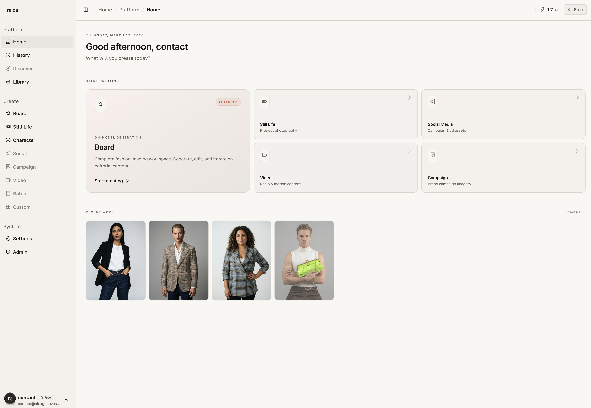

# Getting Started

Generate your first publication-ready image in under 2 minutes. No prompt engineering. No design skills required.

## Choose your starting point

Reica has two main generation modes. Pick the one that matches your goal today:

| Mode | Best for | Start time |
|---|---|---|
| **Still Life** | Product photography, flat lay, ghost mannequin | < 1 min |
| **Board** | Campaign compositions, multi-image looks, editorial | < 2 min |

---

## Quick Win: Product Shot in 60 Seconds

The fastest path from zero to a finished image.

### Step 1 — Open Still Life

From the Home dashboard, click **Still Life** in the shortcuts bar.

### Step 2 — Upload your product

Click the upload area and add your product image (JPEG or PNG, any size).

- Front view works for most products
- For apparel: upload both **front and back** to improve generation quality

### Step 3 — Configure the shot

Set these three options (all have smart defaults — you can skip them on your first try):

1. **Output type** — choose Ghost, Flat Lay, On-model, or Still Life
2. **Background** — pick a color or leave transparent
3. **Lighting** — studio, natural, dramatic, or soft

### Step 4 — Generate

Click **Generate**. Your image is ready in seconds.

### Step 5 — Download or reuse

- Click the image to open it full-size
- Download in up to **4K resolution**
- Click **Use for new generation** to build on the result

---

## Quick Win: Campaign Board in 2 Minutes

### Step 1 — Create a new Board

From Home, click **New Board**. Give it a name.

### Step 2 — Add a reference image

Drag any reference image onto the canvas — a model photo, a garment flat, a mood image.

### Step 3 — Select and generate

Click the node to select it. Choose a photographic style, then hit **Generate**.

### Step 4 — Link and expand

Use the **+** button on any node to link it to new generations and build a full campaign from a single reference.

---

## What's next?

- [How It Works](/how-it-works) — understand the AI logic in plain language
- [Still Life feature guide](/features/still-life) — master every setting
- [Board feature guide](/features/board) — build campaign-scale compositions
